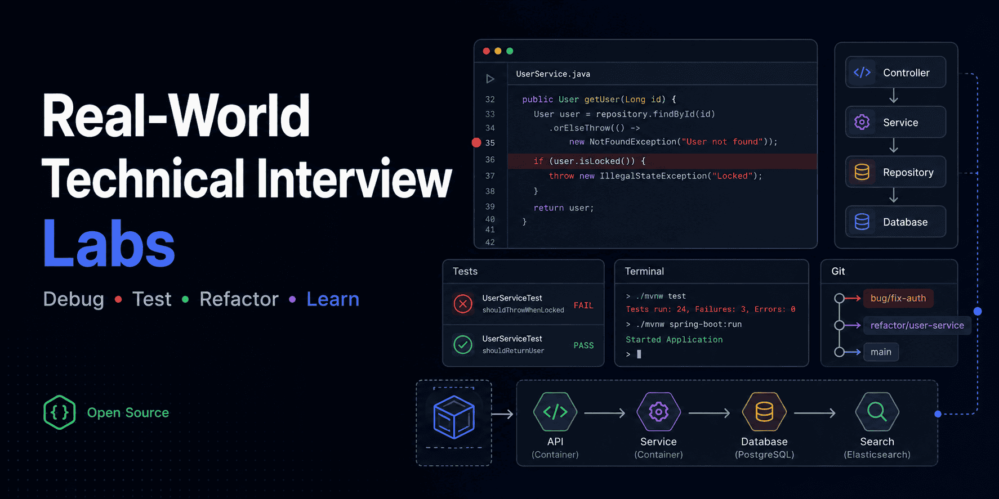

# StackQuest Labs

**Debug • Test • Refactor • Learn**

[English](README.md) | [Español](README.es.md)

[](LICENSE) [](https://github.com/eChrls/StackQuest-Labs/stargazers) [](https://github.com/eChrls/StackQuest-Labs/forks) [](https://github.com/eChrls/StackQuest-Labs/actions/workflows/workspace-integrity.yml)



Real-world Dockerized labs for technical interviews and applied learning. StackQuest Labs develops debugging, testing, refactoring, unfamiliar-codebase, backend, frontend, database, data, AI, and cloud/DevOps skills through reproducible projects.

This is not LeetCode, isolated algorithms, a syntax tutorial, or a kata collection. It is practice with unfamiliar codebases, debugging, failing tests, legacy code, refactoring, REST, databases, frontend/backend integration, data work, production-minded reasoning, and technical interviews.

## The work behind the interview

Many real assessments do not give you an empty editor. They give you this:

```text
an unfamiliar project
        ↓
run it
        ↓
understand it
        ↓
reproduce the problem
        ↓
inspect tests/logs
        ↓
debug
        ↓
fix/refactor
        ↓
verify
        ↓
explain the decision
```

That workflow is the identity of this project.

## Canonical status system

| Status           | Meaning                                                                 |
| ---------------- | ----------------------------------------------------------------------- |
| `✅ DONE`        | Exists, is validated, and is synchronized/published when applicable.    |
| `🟡 IN PROGRESS` | Active work exists but does not meet its Definition of Done yet.        |
| `🧪 VALIDATION`  | Implementation appears complete, but mandatory verification is missing. |
| `⏳ PENDING`     | Planned but not started or not yet available.                           |
| `🚫 NOT PLANNED` | Consciously not planned at present.                                     |

Creating files or writing code is not enough to mark an item `✅ DONE`. A Lab needs evidence of a reproducible project, the expected challenge test state, a temporarily demonstrated solution, complete documentation, validated Docker, and commit/push when applicable. Open-source infrastructure must be applied, checked, and synchronized. When evidence is incomplete, use `🧪 VALIDATION` or `🟡 IN PROGRESS`.

## Lab catalog

All eight official Labs remain visible regardless of implementation status. A Lab being available does not mean every planned difficulty track exists.

| Lab                                                                         | Stack                                                                   | Focus                                                                       | Base         | Easy         | Intermediate | Advanced           | Agent Continuity | Full experience |
| --------------------------------------------------------------------------- | ----------------------------------------------------------------------- | --------------------------------------------------------------------------- | ------------ | ------------ | ------------ | ------------------ | ---------------- | --------------- |
| [Lab 01 — Java/Spring Debugging](./lab-01-java-spring-debugging/)           | Java 21, Spring Boot, Maven, PostgreSQL, JUnit                          | Unfamiliar backend, Java/Spring, REST, PostgreSQL, tests, debugging         | `✅ DONE`    | `✅ DONE`    | `✅ DONE`    | `✅ DONE`          | `✅ DONE`        | `✅ DONE`       |
| [Lab 02 — Java Legacy & Refactoring](./lab-02-java-legacy-refactoring/)     | Java 21, Spring Boot, PostgreSQL, JUnit/Mockito                         | Legacy, characterization tests, refactoring, side effects, TDD              | `✅ DONE`    | `✅ DONE`    | `✅ DONE`    | `✅ DONE`          | `✅ DONE`        | `✅ DONE`       |
| [Lab 03 — React + Spring Full-Stack](./lab-03-react-spring-fullstack/)      | React, TypeScript, Java, Spring Boot, PostgreSQL                        | HTTP, DTOs, async state, JPA, transactions, cross-layer debugging           | `✅ DONE`    | `✅ DONE`    | `✅ DONE`    | `⏳ PENDING`       | `✅ DONE`        | `⏳ PENDING`    |
| [Lab 04 — Angular + Spring Enterprise](./lab-04-angular-spring-enterprise/) | Angular, TypeScript, Java, Spring Boot, PostgreSQL                      | Enterprise full-stack, validation, authorization and integration            | `✅ DONE`    | `✅ DONE`    | `✅ DONE`    | optional/community | `✅ DONE`        | `✅ DONE`       |
| [Lab 05 — Vue + Laravel/PHP Full-Stack](./lab-05-vue-laravel-php/)          | Vue 3, TypeScript, PHP, Laravel, MySQL                                  | Product features, validation, persistence and integration                   | `✅ DONE`    | `✅ DONE`    | `✅ DONE`    | optional/community | `✅ DONE`        | `✅ DONE`       |
| [Lab 06 — Python Data Engineering](./lab-06-python-data-engineering/)       | Python, FastAPI, PostgreSQL, Elasticsearch                              | Backend, ETL, reporting, data quality, SQL, synchronization, search         | `✅ DONE`    | `✅ DONE`    | `✅ DONE`    | `⏳ PENDING`       | `✅ DONE`        | `⏳ PENDING`    |
| [Lab 07 — Applied AI Engineering](./lab-07-applied-ai-engineering/)         | Python, FastAPI, Pydantic, PostgreSQL/pgvector, AI provider abstraction | Applied AI Engineering: prompting, extraction, RAG, evals, tools, debugging | `✅ DONE`    | `✅ DONE`    | `✅ DONE`    | `🚫 NOT PLANNED`   | `✅ DONE`        | `✅ DONE`       |
| [Lab 08 — AWS Cloud & DevOps](./lab-08-aws-cloud-devops/)                   | Docker, AWS, Terraform, GitHub Actions, PostgreSQL                      | Cloud deployment, CI/CD, IaC, security, observability and teardown          | `⏳ PENDING` | `⏳ PENDING` | `⏳ PENDING` | `🚫 NOT PLANNED`   | `⏳ PENDING`     | `⏳ PENDING`    |

Lab 01 and Lab 02 are complete at 100%. Lab 03 has Easy and Intermediate validated, while Advanced A1/A2 still require technical validation. Lab 04 and Lab 05 have completed their initial scopes; Advanced remains optional/community. Lab 06 has Foundation, Easy, and Intermediate validated; Advanced remains pending. Lab 07 has completed its full initial scope: Easy baseline 4 tests with 3 deliberate failures and temporary 4/4 pass; Intermediate covers I1 retrieval/grounding/citations/no-answer, I2 read-only SQLite/Text-to-SQL, and I3 prompt injection/permissions/tool safety, with a final baseline of 7 tests (1 pass + 6 deliberate failures) and temporary 7/7 pass. Evidence commit: `7cac482`. See the detailed [roadmap](docs/ROADMAP.md).

## Real-world assessment patterns

The challenges are original but shaped by recurring patterns in publicly available technical assessments. Research includes GetYourGuide, Personio, Crewmeister, George, FACEIT, Mimo, Equal Experts, Primer, Flipdish, and Wise. Lab 07 may also draw on public patterns documented from the Inato AI Engineer test, Hex AI Engineering take-home, and AI Engineering Field Guide: baseline plus evaluation, document extraction, RAG, tool use, Text-to-SQL, held-out evals, and explaining experiments and trade-offs.

> Inspired by recurring patterns observed in publicly available European technical assessments.

These are research references, not exercises to copy or claims of affiliation. The authoritative research, originality, copyright, difficulty, hint, and editorial rules live in the [Interview Research & Editorial Guide](docs/INTERVIEW_RESEARCH_AND_EDITORIAL_GUIDE.md).

## Difficulty tracks

### Easy

Eventually available in every Lab: reduced scope, visible starting point, a known failing test or endpoint, progressive hints, and foundational skills.

### Intermediate

Eventually available in every Lab: multiple files/layers, debugging, DB/API interaction, decisions, and regression risk.

### Advanced

Mandatory eventually for Lab 01, Lab 02, Lab 03, and Lab 06; optional future/community expansion for Lab 04 and Lab 05. Lab 07 Advanced is `🚫 NOT PLANNED` for its initial scope. Advanced work elsewhere must involve genuinely advanced concerns: concurrency, locking, transaction boundaries, performance, SQL/query plans, idempotency, data consistency, production incidents, Elasticsearch synchronization, or scalability trade-offs.

Docker does not increase challenge difficulty; it provides infrastructure.

## Standard challenge format and hints

```text
Context
Observed behaviour
Expected behaviour
Reproduction
Constraints
Acceptance criteria
Starting point / progressive hints
Follow-up discussion
```

Easy has an explicit starting point. Intermediate provides reproduction plus progressive hints. Advanced exposes the symptom and acceptance criteria with minimal help. Never use artificial comments such as `// BUG HERE`; code comments must look plausible in production. Full rules are in the [editorial guide](docs/INTERVIEW_RESEARCH_AND_EDITORIAL_GUIDE.md).

## Usage modes

| Mode           | Intended experience                                                          | Status       |
| -------------- | ---------------------------------------------------------------------------- | ------------ |
| Learning Mode  | Progressive hints, documentation, no time pressure.                          | `⏳ PENDING` |
| Interview Mode | Suggested timebox, difficulty-appropriate hints, observable reasoning.       | `⏳ PENDING` |
| Review Mode    | Root cause, code review, alternatives, production concerns, small follow-up. | `⏳ PENDING` |

These modes are the global target; they are not yet formalized consistently in every Lab.

## Debugging is a core skill

| Stack             | Debugging                                                     |
| ----------------- | ------------------------------------------------------------- |
| Java/Spring       | JVM debugger, breakpoints, call stack, variables, JUnit, logs |
| React/Angular/Vue | Browser DevTools, Network, Console, Sources, tests            |
| Node              | Debugger, async stack, logs, tests                            |
| PHP               | Stack traces, logs, tests/debugger                            |
| Python            | Debugger, exceptions, logging, pytest                         |
| PostgreSQL        | Diagnostic SQL, `EXPLAIN`, locks, data comparison             |
| Elasticsearch     | Queries, mappings, documents, synchronization state           |

Docker is infrastructure, not the learning objective. An agent may perform Docker operations so the learner can focus on investigation and reasoning.

## Tests are evidence

Tests are acceptance criteria, debugging evidence, and regression protection—not merely a final check. Labs may deliberately begin with red tests; this documents the challenge baseline and does not mean the repository is broken.

## Docker-first and portable

```text
clone repo
   ↓
Docker + Compose
   ↓
choose Lab
   ↓
build isolated environment
```

Java/Maven, Node/npm, PHP/Composer, Python, PostgreSQL, MySQL, and Elasticsearch do not need global installation. Each Lab defines its environment. Every Lab must rebuild on another computer using essentially Git, Docker, and Docker Compose. Initial databases come from versioned migrations, seeds, or fixtures—not copied personal volumes. Current portability: `✅ DONE` for existing Lab baselines, supported by versioned setup and validated Compose.

## Lab 07 — Applied AI Engineering

**Prompting • RAG • Evals • Tools • Debugging**

Status: `✅ DONE` · Primary objective: **Self-learning** · Secondary objective: **Realistic AI Engineer interview practice**.

Unlike Labs 1–6, its main purpose is not exclusively to simulate technical assessments. It will teach practical AI Engineering through progressive, original, measurable problems while incorporating patterns from public assessments when useful. It remains Docker-first, reproducible, portable, realistic, debugging-oriented, and evidence-driven: tests and evals must demonstrate behavior.

### Planned stack and provider policy

The provisional stack is Python, FastAPI, Pydantic, PostgreSQL, pgvector when RAG is introduced, pytest, Docker, Docker Compose, embeddings, RAG, evals, and tool calling. Exact versions will be selected during implementation.

```text
AI Provider
├── deterministic fake/mock
├── external API
└── optional local model
```

Fundamental tests and evals must run without a paid API, Internet access, or nondeterministic LLM behavior. A real provider may be configured through `.env`; a small local model may be offered optionally. Ollama is optional and never the baseline.

The Lab must run reasonably on Linux and Windows through Docker Desktop/WSL2 or equivalent, on a modern standard CPU and reasonable consumer RAM. A dedicated GPU, NVIDIA hardware, CUDA, Apple Silicon, high-end hardware, large local models, or specialized hardware must never be required. Lack of a GPU cannot prevent completion.

### Planned progression

| Track        | Stage                          | Learning outcomes                                                                                                                                              | Status           |
| ------------ | ------------------------------ | -------------------------------------------------------------------------------------------------------------------------------------------------------------- | ---------------- |
| Easy         | E1 — Prompt engineering        | System/user instructions, precision, constraints, structured output, valid JSON, iteration                                                                     | `✅ DONE`        |
| Easy         | E2 — CV information extraction | Original fictional CVs; technology, periods, experience, terms, missing data; baseline search/regex/fake first                                                 | `✅ DONE`        |
| Easy         | E3 — Evaluation basics         | Dataset, expected output, precision, false positives/negatives; “looks good” is not reliable evidence                                                          | `✅ DONE`        |
| Intermediate | RAG                            | Documents, chunking, embeddings, retrieval, top-k, citations, grounding, no-answer cases                                                                       | `✅ DONE`        |
| Intermediate | AI debugging                   | Trace input → parsing → chunking → embedding → retrieval → context → prompt → generation → validation                                                          | `✅ DONE`        |
| Intermediate | Evals                          | Visible dataset, regressions, retrieval quality, answer and citation correctness                                                                               | `✅ DONE`        |
| Intermediate | Tool calling                   | Controlled document search, read-only SQL, calculator, structured lookup                                                                                       | `✅ DONE`        |
| Intermediate | Text-to-SQL                    | Natural language → safe SQL → PostgreSQL → answer, with destructive SQL blocked                                                                                | `✅ DONE`        |
| Intermediate | Basic AI security              | Prompt injection, tool permissions, sensitive-data boundaries, output validation                                                                               | `✅ DONE`        |
| Integrated   | Final applied challenge        | Combine foundations, retrieval, evals, tools, debugging, and justified trade-offs                                                                              | `✅ DONE`        |
| Advanced     | Initial Lab 07 scope           | No large-model training/fine-tuning, CUDA, distributed ML, heavy serving, deep transformer internals, large local models, or complex multi-agent architectures | `🚫 NOT PLANNED` |

The governing principle is: establish a baseline, measure it, and introduce AI only when it demonstrably improves the result. Future community extensions may revisit excluded areas if there is demand.

### Lab 06 and Lab 07 are different

- **Lab 06 — Data Engineering/backend:** ETL, PostgreSQL, Elasticsearch, data quality, pipelines, and reporting.
- **Lab 07 — AI Engineering:** prompts, extraction, embeddings, RAG, evals, tools, and AI debugging.

They may share technologies, but they do not share learning objectives.

## Lab 08 — AWS Cloud & DevOps

**Docker • AWS • CI/CD • Terraform • Debugging**

Status: `⏳ PENDING`. The [planning scaffold](lab-08-aws-cloud-devops/README.md) defines a Docker-first local baseline, optional AWS live mode, Cost Gate, EC2/networking/RDS/ECR/CI/CD/Terraform/observability progression, and mandatory teardown. The main learning path has no paid requirement.

AWS credits, pricing, and Free Tier/Free Plan eligibility are time-sensitive. Re-check official AWS documentation before every live deployment; the research snapshot is in the [editorial guide](docs/INTERVIEW_RESEARCH_AND_EDITORIAL_GUIDE.md).

## Documentation hierarchy

- **[README.md](README.md):** global identity, vision, catalog, status, summary roadmap, objectives, tracks, and milestones.
- **[docs/INTERVIEW_RESEARCH_AND_EDITORIAL_GUIDE.md](docs/INTERVIEW_RESEARCH_AND_EDITORIAL_GUIDE.md):** authoritative source for realism, research, difficulty, challenge design, hints, editorial criteria, originality, and follow-up discussion.
- **[docs/LAB_SPEC.md](docs/LAB_SPEC.md):** mandatory technical contract for creating a Lab.
- **`lab-NN-stack-focus/README.md`:** Lab-specific context, operation, baseline, and tickets.
- **[docs/ROADMAP.md](docs/ROADMAP.md):** detailed roadmap and future evolution.

## Open-source contributions

Contributions are welcome: a New Lab, new or advanced challenge, bug report, tests, documentation, portability, accessibility, an alternative stack, or a realistic production scenario. Read [CONTRIBUTING.md](CONTRIBUTING.md) before proposing work.

## Community status board

| Capability                 | Status                          |
| -------------------------- | ------------------------------- |
| Public repository          | `✅ DONE`                       |
| MIT License                | `✅ DONE`                       |
| CONTRIBUTING               | `✅ DONE`                       |
| Code of Conduct            | `✅ DONE`                       |
| Security policy            | `✅ DONE`                       |
| Issue Forms                | `✅ DONE`                       |
| PR template                | `✅ DONE`                       |
| Discussions                | `✅ DONE`                       |
| Topics                     | `✅ DONE`                       |
| Labels                     | `✅ DONE`                       |
| CODEOWNERS                 | `✅ DONE`                       |
| Community Profile 100%     | `✅ DONE`                       |
| Workspace integrity CI     | `✅ DONE`                       |
| Social Preview             | `✅ DONE` (configured manually) |
| GitHub Pages               | `⏳ PENDING`                    |
| Custom domain              | `🚫 NOT PLANNED`                |
| First external contributor | `⏳ PENDING`                    |
| First community Lab        | `⏳ PENDING`                    |
| First release              | `⏳ PENDING`                    |

The [social preview asset](docs/assets/social-preview.png) is retained for GitHub, LinkedIn, and community sharing. Pages will be evaluated only when core Labs are stable, community documentation is mature, and a clear use exists. GitHub remains the primary platform; a separate website/domain is not needed for usability today.

## Discovery and community milestones

| Milestone                   | Status       |
| --------------------------- | ------------ |
| First external star         | `⏳ PENDING` |
| First external fork         | `⏳ PENDING` |
| First external contributor  | `⏳ PENDING` |
| First external PR           | `⏳ PENDING` |
| First community-created Lab | `⏳ PENDING` |
| First release               | `⏳ PENDING` |

No metric is inferred or manufactured; a milestone moves only with public evidence.

## Master roadmap

| Area                 | Capability                            | Status           |
| -------------------- | ------------------------------------- | ---------------- |
| Foundation           | Open-source foundation                | `✅ DONE`        |
| Foundation           | Global documentation                  | `✅ DONE`        |
| Foundation           | Community infrastructure              | `✅ DONE`        |
| Foundation           | Editorial research                    | `✅ DONE`        |
| Core Labs            | Lab 01                                | `✅ DONE`        |
| Core Labs            | Lab 02                                | `✅ DONE`        |
| Core Labs            | Lab 03 base challenge                 | `✅ DONE`        |
| Core Labs            | Lab 04 — Angular + Spring Enterprise  | `✅ DONE`        |
| Core Labs            | Lab 05 — Vue + Laravel/PHP Full-Stack | `✅ DONE`        |
| Core Labs            | Lab 06 — Python Data Engineering      | `🟡 IN PROGRESS` |
| Core Labs            | Lab 07 — Applied AI Engineering       | `⏳ PENDING`     |
| Core Labs            | Lab 08                                | `⏳ PENDING`     |
| Difficulty expansion | Easy in all eight Labs                | `⏳ PENDING`     |
| Difficulty expansion | Intermediate in all eight Labs        | `⏳ PENDING`     |
| Difficulty expansion | Advanced Lab 01                       | `✅ DONE`        |
| Difficulty expansion | Advanced Lab 02                       | `⏳ PENDING`     |
| Difficulty expansion | Advanced Lab 03                       | `⏳ PENDING`     |
| Difficulty expansion | Advanced Lab 06                       | `⏳ PENDING`     |
| Difficulty expansion | Advanced Lab 07                       | `🚫 NOT PLANNED` |
| Difficulty expansion | Advanced Lab 08                       | `🚫 NOT PLANNED` |
| Learning experience  | Progressive hints                     | `⏳ PENDING`     |
| Learning experience  | Learning Mode                         | `⏳ PENDING`     |
| Learning experience  | Interview Mode                        | `⏳ PENDING`     |
| Learning experience  | Review Mode                           | `⏳ PENDING`     |
| Learning experience  | Time estimates                        | `⏳ PENDING`     |
| Learning experience  | Follow-up questions                   | `⏳ PENDING`     |
| Community            | Good first issues                     | `⏳ PENDING`     |
| Community            | First external contribution           | `⏳ PENDING`     |
| Community            | First community Lab                   | `⏳ PENDING`     |
| Community            | Release/versioning                    | `⏳ PENDING`     |
| Future               | GitHub Pages                          | `⏳ PENDING`     |
| Future               | Additional stacks/community Labs      | `⏳ PENDING`     |
| Future               | Custom domain                         | `🚫 NOT PLANNED` |

## Maintaining this roadmap

> Planned capabilities remain visible even while pending. When a milestone is completed, update its status instead of removing it.

Any agent that completes a milestone must update this README in the same PR/commit when appropriate. Status moves to `✅ DONE` only with evidence of its completion criteria.

## Temporary construction order

The temporary build order is Lab 01 → Lab 02 → Lab 03 → Lab 06 → Lab 07 → Lab 04 → Lab 05 → Lab 08. It stabilizes the Reference Lab pattern before eight implementations diverge and may be removed once all Labs are complete.

## Agent Continuity standard

A Lab is 100% complete only when a new agent, using the global sources and the Lab-specific README, can understand the challenge, guide the learner, provide progressive hints, teach the related concept, distinguish challenge defects from infrastructure failures, validate a solution, explain root causes and alternatives, and provide a complete resolution when the learner is blocked. Lab 01 has passed this test and is the completed Reference Lab; Lab 02 and Lab 03 will be adapted differentially afterward.

## Project continuity context

This is an open-source, Docker-first collection of eight original, realistic Labs for technical interviews and applied learning. Labs 01–06 emphasize assessment practice, Lab 07 prioritizes Applied AI learning, and Lab 08 adds optional, cost-gated cloud/DevOps learning. Easy and Intermediate are planned across all eight; Advanced is mandatory for Labs 01, 02, 03, and 06, optional/community-driven for Labs 04 and 05, and initially not planned for Labs 07 and 08.

Released under the [MIT License](LICENSE).
